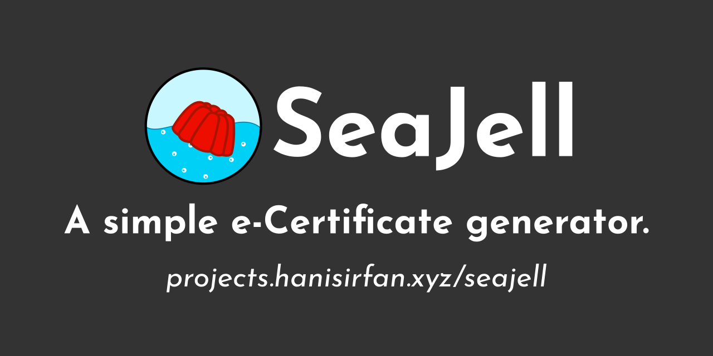

<link rel="shortcut icon" type="image/png" href="favicon.png">

# Welcome to the SeaJell website.

 

## Menu
- [Installation](installation)
- [Tutorial Videos](tutorials)
- [Screenshots](screenshots)
- [Credits](credits)
- [License](credits#license)

### Tutorial Videos
You may watch the tutorial videos made for this project for guidance, [here](tutorials).

### Screenshots
All the screenshots of the system can be seen here [here](screenshots).

### Language Support
Malay is the only available language available for the UI. Maybe new language especially English will be added soon.

### License
Copyright (c) Muhammad Hanis Irfan bin Mohd Zaid

This system/project is licensed under GNU GPLv3. Each contributions to this system will be licensed under the same terms. Contributions are listed in CREDITS and the website in the future.
